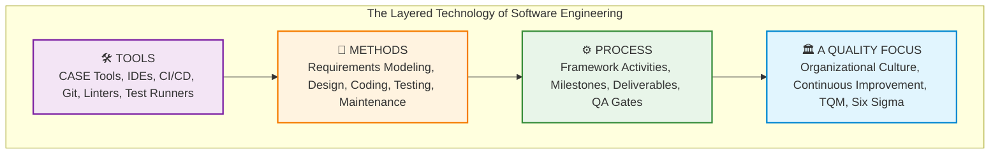

# Week 1: Introduction to the Essence of Software & Software Engineering

> **Course:** IS 507 — Introduction to Software Engineering (METU Informatics Institute)  
> **Textbook Reference:** Roger S. Pressman, *Software Engineering: A Practitioner's Approach* (7th Ed., 2010), Chapter 1 (pp. 1–28)  
> **Syllabus Module:** Week 1 — Introduction to Software & Software Engineering  
> **Prerequisites / Context:** Foundational lecture establishing engineering discipline, software characteristics, layered technology, process framework, and dispelling software myths.

---

## 1. 🎯 Executive Context & The "Why It Matters" Angle

### 1.1 The Software Reality of the Modern Enterprise
In 2011, venture capitalist Marc Andreessen coined the phrase *"Software is eating the world."* Today, software is no longer merely a support function for business operations; software **is** the business. From automated financial exchanges executing microsecond arbitrage to fly-by-wire avionics, medical implants, and autonomous logistics, modern civilization runs on software.

Yet, building large-scale, dependable software remains one of humanity's most complex intellectual undertakings. Software systems routinely comprise millions—sometimes hundreds of millions—of lines of code, orchestrating concurrent interactions across distributed, heterogeneous platforms.

### 1.2 The Genesis of Software Engineering: The 1968 NATO Conference
To understand why software engineering exists, graduate engineers must understand the **"Software Crisis"** of the late 1960s. During the first two decades of computing, software was treated as an artisanal craft or art form:
* Individual programmers wrote bespoke assembly or early high-level code without formal requirements, architectural specifications, or repeatable testing methodologies.
* As hardware capacity expanded exponentially (governed by Moore's Law), the scale and ambition of software exploded. The informal, artisanal approaches collapsed under the weight of runaway complexity.
* Projects routinely blew past budgets by orders of magnitude, missed deadlines by years, and produced systems rife with critical bugs or that failed to satisfy basic customer needs.

In **October 1968**, the NATO Science Committee convened a historic conference in **Garmisch, Germany**, bringing together 50 top computer scientists, industry practitioners, and academics. They deliberately coined the term **"Software Engineering"** to declare a paradigm shift:

> *"The phrase 'software engineering' was deliberately chosen as being provocative, in that it implies the need for software to be built in a manner based on the theoretical foundations and practical disciplines established in other engineering branches."*  
> — NATO Conference Report (F.L. Bauer, 1968)

Software engineering emerged to transform programming from an individual craft into a predictable, rigorous, quantifiable engineering discipline.

---

## 2. 🧠 Deep Conceptual Breakdown

### 2.1 The Nature and Dual Role of Software

Pressman emphasizes that software is both a **product** and a **vehicle**:
1. **Software as a Product:** It delivers computing potential embodied by computer hardware or networks. It transforms, manages, acquires, modifies, displays, or transmits information.
2. **Software as a Vehicle:** It acts as the delivery engine for products and services. It controls operating systems, network communication, databases, automated development tools (CASE), and CI/CD deployment pipelines.

#### Fundamental Characteristics of Software vs. Physical Hardware

| Characteristic | Physical Hardware | Software |
| :--- | :--- | :--- |
| **Manufacturing vs. Development** | Manufactured in factories; physical assembly line; raw material costs dominate replication. | Developed or engineered; intellectual design dominates; replication cost is near zero. |
| **Failure Mechanism** | **Wears out** due to physical wear, friction, oxidation, thermal stress, vibration. | **Does not wear out** physically. It **deteriorates** due to side effects of changes (architectural entropy). |
| **Component Reusability** | Highly standardized (off-the-shelf ICs, microprocessors, standard resistors/capacitors). | Historically custom-built; component reuse is improving (APIs, microservices, libraries) but still evolving. |
| **Replacement / Spare Parts** | Replaced with physical spare parts when damaged. | No spare parts exist; software repair requires modifying code and updating design baselines. |

---

### 2.2 The Software Failure Curve: Bathtub Curve vs. Change Deterioration

Hardware failure follows the well-known **"bathtub curve"**:
1. **Infant mortality:** High initial failure rate due to manufacturing defects, which drop off rapidly.
2. **Useful life:** A long period of low, steady failure rate.
3. **Wear-out phase:** Failure rate rises sharply as physical components degrade over time.

```
Hardware Bathtub Curve:
Failure Rate
  ^
  |  \                                      /
  |   \                                    /
  |    \                                  /
  |     \________________________________/
  +---------------------------------------------> Time
      Infant         Useful Life        Wear-out
      Mortality
```

Software does **not** experience physical wear-out. An ideal software curve shows an initial high failure rate (uncovering undiscovered design and coding bugs), dropping to a very low, constant, stable plateau indefinitely.

However, the **actual software curve** behaves drastically differently due to change requests. Every time software is modified (to fix a bug, adapt to new environments, or add functionality), **unintended side effects** are injected:

```
Actual Software Failure Curve (Pressman Fig. 1.2):
Failure Rate
  ^
  |  \      |\          |\          |\
  |   \     | \  /\     | \  /\     | \  /\
  |    \    |  \/  \    |  \/  \    |  \/  \  (Deteriorating baseline)
  |     \___|_______\___|_______\___|_______\____
  +---------------------------------------------> Time
        Initial  Change 1   Change 2   Change 3
        Release
```

Each change creates a spike in failure rate. Before the curve can drop back to its previous baseline, another change is introduced, raising the steady-state baseline higher each time. This phenomenon is known as **architectural decay** or **software entropy**.

---

### 2.3 Software Application Domains

Pressman categorizes modern software into seven broad application domains:

1. **System Software:** Infrastructure software servicing other programs (e.g., compilers, operating systems, hypervisors, device drivers, network protocols). Characterized by heavy interaction with hardware, multi-user concurrency, and resource scheduling.
2. **Application Software:** Standalone programs solving specific business or consumer needs (e.g., enterprise transaction systems, point-of-sale, spreadsheet software, inventory tracking).
3. **Engineering / Scientific Software:** Computation-intensive algorithms (e.g., CAD/CAM, finite-element structural analysis, orbital mechanics, genome sequencing, molecular modeling).
4. **Embedded Software:** Resides within a product or system to control physical features (e.g., digital engine management in automobiles, microwave keypads, pacemaker controllers, avionics fly-by-wire).
5. **Product-Line Software:** Packaged commercial software designed to serve thousands of diverse customers with customized configurations (e.g., SAP ERP, Salesforce CRM, word processing suites).
6. **Web Applications (WebApps):** Network-centric applications spanning distributed architectures. Characterized by high concurrency, unpredictable load swings, continuous evolution, data-driven interfaces, and intense security requirements.
7. **Artificial Intelligence (AI) Software:** Software utilizing non-numerical algorithms to solve complex heuristic problems (e.g., deep neural networks, computer vision, natural language processing, LLM-based autonomous agents).

---

### 2.4 Legacy Software: Why Systems Must Evolve

A substantial portion of world enterprise software is **legacy software**—systems developed decades ago (e.g., mainframe banking backends in COBOL) that remain the lifeblood of corporate operations.

#### Why Legacy Systems Cannot Simply Be Discarded
Rewriting legacy systems from scratch carries immense operational risk. Consequently, they must continually evolve. Pressman outlines the **four major drivers of software evolution**:

1. **Adaptation:** The software must be adapted to run in new computing environments (e.g., migrating from on-premise mainframe hardware to containerized cloud architectures like AWS/GCP).
2. **Enhancement:** The software must be enhanced to satisfy new business requirements, regulatory compliance, or competitive features.
3. **Extension:** The software must be extended to interoperate with modern systems, RESTful APIs, and relational/NoSQL databases.
4. **Re-architecting:** The software architecture must be restructured (e.g., decomposed from a monolithic codebase into microservices) to ensure long-term viability in networked environments.

#### Lehman’s Laws of Software Evolution
Professor Meir Lehman established foundational laws governing software system dynamics:
* **The Law of Continuing Change:** An enterprise software system must undergo continual change or it becomes progressively less useful.
* **The Law of Increasing Complexity:** As a system evolves, its complexity increases unless deliberate work is done to maintain or reduce it (refactoring, modular decoupling).

---

### 2.5 Defining Software Engineering & The Layered Technology

The authoritative definition codified by IEEE Standard 610.12 states:

> **Software Engineering:** *(1) The application of a systematic, disciplined, quantifiable approach to the development, operation, and maintenance of software; that is, the application of engineering to software. (2) The study of approaches as in (1).*

#### Pressman's 4-Layered Technology of Software Engineering

Software engineering is modeled as a layered technology. Every layer depends upon the layer below it:

```
┌────────────────────────────────────────────────────────┐
│                        TOOLS                           │  (Layer 3)
├────────────────────────────────────────────────────────┤
│                       METHODS                          │  (Layer 2)
├────────────────────────────────────────────────────────┤
│                       PROCESS                          │  (Layer 1)
├────────────────────────────────────────────────────────┤
│                  A QUALITY FOCUS                       │  (Bedrock Foundation)
└────────────────────────────────────────────────────────┘
```

1. **A Quality Focus (The Bedrock Foundation):**
   * Any engineering discipline must rest on an organizational commitment to quality.
   * Fosters continuous process improvement (Total Quality Management - TQM, Six Sigma, CMMI).
   * Culture where cutting corners on verification and architecture is recognized as fatal to the enterprise.

2. **Process (The Glue / Infrastructure):**
   * The connective tissue that holds all technology layers together.
   * Defines a framework for activities, actions, milestones, deliverables, quality assurance gates, and change management.
   * Establishes the context in which technical methods are applied and products are delivered predictably.

3. **Methods (The Technical "How-To's"):**
   * Provide the technical expertise required to build software.
   * Encompasses communication, requirements elicitation and modeling, software architecture, data structure design, coding, algorithmic construction, unit/integration testing, and operational support.

4. **Tools (Automated / Semi-Automated Support):**
   * Provide automated or semi-automated support for the process and methods.
   * Includes Integrated Development Environments (IDEs), Computer-Aided Software Engineering (CASE) tools, version control (Git), automated CI/CD build pipelines, static analysis linters, and bug-tracking databases.

---

### 2.6 The Generic Process Framework

A **software process** is defined as a framework for the activities, actions, and tasks required to build high-quality software. Pressman establishes that a generic process framework encompasses two sets of activities: **Framework Activities** and **Umbrella Activities**.

#### The 5 Generic Framework Activities
Applicable to all software projects regardless of complexity, domain, or team size:

1. **Communication:** Collaborative engagement between engineers and stakeholders to understand system objectives, scope, and elicit initial requirements.
2. **Planning:** Establishing the technical roadmap. Defines tasks, estimates costs and effort, identifies technical and project risks, defines resources, and creates project schedules.
3. **Modeling:** Creating representations ("blueprints") of what is being built.
   * *Analysis Modeling:* Capturing system requirements, user stories, use cases, data models.
   * *Design Modeling:* Architecting software components, interfaces, database schemas, and dynamic interactions.
4. **Construction:** Combining code generation (manual programming or automated code synthesis) with rigorous testing (unit, integration, regression) to identify and eliminate bugs.
5. **Deployment:** Delivering the operational software product (or an incremental release) to the end user for evaluation, feedback, and operational usage.

#### The 8 Umbrella Activities
Umbrella activities span the entire lifecycle and occur concurrently across all framework activities:

1. **Software Project Tracking and Control:** Comparing actual progress against project schedules and budgets; taking corrective management action when slippage occurs.
2. **Risk Management:** Continuously identifying, assessing, mitigating, monitoring, and managing technical, business, and operational risks.
3. **Software Quality Assurance (SQA):** Independent audits and structured verification activities ensuring that process standards and engineering practices are upheld.
4. **Technical Reviews:** Structured peer reviews and inspections of work products (requirements specs, architecture diagrams, code pull requests) to detect and filter defects before they propagate.
5. **Measurement:** Collecting quantitative metrics (process metrics, defect densities, Function Points, lines of code, velocity) to track process capability and product quality.
6. **Software Configuration Management (SCM):** Managing versions, controlling baselines, tracking changes, and auditing alterations across all software work products (code, models, documents).
7. **Reusability Management:** Defining criteria for reusable component creation, maintaining component libraries, and encouraging organizational reuse.
8. **Work Product Preparation and Production:** Creating documentation, deployment guides, user manuals, and training materials needed to support the system.

---

### 2.7 Software Engineering Practice: Polya's Problem Solving & Hooker's 7 Principles

Software engineering practice is the application of engineering discipline to solve human problems.

#### The Essence of Practice (Adapted from George Pólya's *How to Solve It*):
1. **Understand the problem:** Who are the stakeholders? What data, functions, and features are required? Can the problem be partitioned into smaller sub-problems?
2. **Plan the solution:** Have you seen this problem before? Are there existing design patterns or reusable components? Can an architectural model be defined?
3. **Carry out the plan:** Does the implementation conform to the design model? Is each unit tested immediately upon construction?
4. **Examine the result:** Has each requirement been validated against user expectations? Was the software tested against realistic data and edge conditions?

#### David Hooker's 7 Core Principles of Software Engineering
1. **1st Principle: The Reason It All Exists (Provide Value):** A software system exists for one reason and one reason only: to provide value to its users. Every feature, refactoring, and line of code must be justified by value.
2. **2nd Principle: KISS (Keep It Simple, Stupid!):** All design should be as simple as possible, but no simpler. Complexity breeds defects, unmaintainability, and fragile systems.
3. **3rd Principle: Maintain the Vision:** A clear architectural vision is essential. Without a coherent architecture, the system devolves into an unmaintainable "Big Ball of Mud."
4. **4th Principle: What You Produce, Others Will Consume:** Code and documentation will be read, maintained, and modified by engineers who did not write it. Design for readability and comprehensibility.
5. **5th Principle: Be Open to the Future:** Never design yourself into a technical corner. Build systems that accommodate future change, scalability, and platform evolution.
6. **6th Principle: Plan Ahead for Reuse:** Reusability reduces development costs and increases software reliability, but building reusable components requires deliberate upfront investment.
7. **7th Principle: Think!:** Clear, deliberate thought before typing code prevents catastrophic rework. Understand requirements and design before executing.

---

### 2.8 The Anatomy of Software Myths: Folklore vs. Engineering Reality

Pressman identifies insidious **software myths**—erroneous beliefs promulgated by managers, customers, and practitioners that lead to project failure:

| Category | The Myth | The Engineering Reality |
| :--- | :--- | :--- |
| **Management** | *"We have a book full of standards and procedures. Won't that provide my team with everything they need?"* | Most standard binders are outdated "shelfware" that developers ignore. Process must be adaptable, lean, and integrated into modern developer toolchains. |
| **Management** | *"If we fall behind schedule, we can add more programmers and catch up."* | **Brooks' Law:** *"Adding manpower to a late software project makes it later."* New engineers require ramp-up time from existing developers, increasing communication lines (\(n(n-1)/2\)) and net overhead. |
| **Management** | *"If I outsource the project to a third party, I can relax and let them build it."* | If an organization cannot manage software internally, it will fail catastrophically when managing external vendors. Rigorous technical governance is mandatory. |
| **Customer** | *"A general statement of objectives is enough to start coding; we can fill in details later."* | Ambiguous objectives cause misaligned architectures. Late requirement discovery can cost 10x to 100x more to fix than early elicitation. |
| **Customer** | *"Software requirements change continually, but software is flexible and easy to change anytime."* | While code is malleable, late changes rip through architectural assumptions, database schemas, and integration points, causing massive defect spikes. |
| **Practitioner** | *"Once we write the code and get it running, our job is done."* | **60% to 80%** of all lifecycle effort and cost occurs *after* the software is first delivered to customers (maintenance: corrective, adaptive, perfective). |
| **Practitioner** | *"Until I get the program running, I have no way of assessing its quality."* | Formal technical reviews, static analysis, and design inspections find **70%+** of defects before a single line of code is executed. |
| **Practitioner** | *"The only deliverable work product is the working program."* | Working code without architecture models, documentation, test suites, and configuration baselines quickly degrades into unmaintainable legacy rot. |

---

## 3. 🏢 High-Impact Real-World Case Studies & Applied Examples

### 3.1 The Success Case: Apollo 11 Guidance Computer & Margaret Hamilton (1969)
* **Context:** During the Apollo 11 lunar descent on July 20, 1969, the Apollo Guidance Computer (AGC) was overloaded with unexpected radar data caused by an improperly configured rendezvous radar switch.
* **Engineering Principles Applied:**
  * Margaret Hamilton, Director of the Software Engineering Division of the MIT Instrumentation Laboratory, pioneered **asynchronous executive software architecture**.
  * She implemented **priority scheduling**: when CPU cycles became saturated, the system shed lower-priority radar processing tasks and preserved life-critical descent engine throttle and display commands.
  * Hamilton also championed rigorous verification and error-recovery routines, coining the term *"Software Engineering"* to legitimize the discipline at NASA.
* **The Engineering Takeaway:** Defensively architected software with priority-based task scheduling and fault tolerance can save human lives and multi-billion-dollar missions under unprecedented operational failure modes.

### 3.2 The Cautionary Failure: The Therac-25 Radiation Therapy Disasters (1985–1987)
* **Context:** The Therac-25 was a computer-controlled radiation therapy machine that delivered massive radiation overdoses (up to 100x lethal doses) to at least six cancer patients, causing horrific deaths and injuries.
* **Root Causes:**
  1. **Software Myth Fallacy:** The manufacturer believed the myth that software does not fail if individual modules were tested in isolation. They removed mechanical hardware safety interlocks, relying entirely on software checks.
  2. **Race Condition & Concurrency Defects:** When experienced technicians entered dosage parameters rapidly via a terminal, a race condition occurred between keyboard input interrupts and magnet positioning routines.
  3. **Absence of SQA & Formal Reviews:** The code was written by a single programmer without peer technical reviews, formal requirements specifications, or independent software quality audits.
* **The Engineering Takeaway:** Software must never be treated as an infallible replacement for safety interlocks. Concurrency bugs cannot be found through casual testing; they require formal modeling, defensive design, and independent SQA oversight.

---

## 4. 📊 Visual Mental Models & Flowcharts

### 4.1 Pressman's Layered Technology of Software Engineering



---

### 4.2 The Generic Process Framework: Framework vs. Umbrella Activities

```mermaid
flowchart LR
    subgraph FrameworkActivities ["Generic Framework Activities"]
        direction LR
        A["1. Communication<br>(Inception, Elicitation)"] --> B["2. Planning<br>(Estimates, Schedule, Risks)"]
        B --> C["3. Modeling<br>(Analysis & Design)"]
        C --> D["4. Construction<br>(Code & Test)"]
        D --> E["5. Deployment<br>(Release, Feedback)"]
    end

    subgraph UmbrellaActivities ["Continuous Umbrella Activities (Span Entire Lifecycle)"]
        direction TB
        U1["• Software Project Tracking & Control"]
        U2["• Risk Management"]
        U3["• Software Quality Assurance (SQA)"]
        U4["• Formal Technical Reviews"]
        U5["• Software Configuration Management (SCM)"]
        U6["• Measurement & Metrics"]
        U7["• Reusability Management"]
        U8["• Work Product Preparation"]
    end

    UmbrellaActivities -.-> FrameworkActivities

    style FrameworkActivities fill:#fafafa,stroke:#333,stroke-width:2px;
    style UmbrellaActivities fill:#fffde7,stroke:#fbc02d,stroke-width:2px;
```



---

## 5. ⚡ In-Class Quiz & Exam Readiness ("The High-Yield Survival Pack")

> [!IMPORTANT]
> **IS 507 Assessment Structure:** In-class quizzes constitute **25%** of the course grade (around 5–7 quizzes). While Week 1 does not feature a scheduled quiz, the concepts introduced in this foundational module are heavily tested in **Quiz 1 (Week 4)** and the **Midterm Examination (30%, November 28th)**.

### 5.1 Core Formulas & Heuristics

1. **Brooks’ Law Communication Channel Growth:**
   Adding team members exponentially increases interpersonal communication overhead:
   $$\text{Communication Channels} = \frac{n(n - 1)}{2}$$
   *Where $n$ is the number of engineers.*  
   *Example:* A team of 5 has $\frac{5(4)}{2} = 10$ communication channels. Adding 5 more engineers to make 10 increases channels to $\frac{10(9)}{2} = 45$ (a 350% increase in communication overhead!).

2. **Verification vs. Validation (Boehm's Duality):**
   * **Verification:** *"Are we building the product right?"* (Ensuring the software conforms to its technical specifications and design constraints).
   * **Validation:** *"Are we building the right product?"* (Ensuring the software satisfies the customer's actual operational business needs).

---

### 5.2 High-Yield Exam / Quiz Practice Questions

#### Question 1 (Conceptual Trade-off — The Software Failure Curve)
**Prompt:** Why does software failure rate spike repeatedly over its operational lifecycle, whereas hardware failure rate remains relatively flat throughout its useful life?
* **A)** Software components suffer physical fatigue from millions of machine cycles.
* **B)** Unintended side effects introduced during bug fixes and feature modifications degrade the software architecture and introduce new latent defects.
* **C)** Compilers and operating systems deteriorate as new files are stored on server disks.
* **D)** Software engineers fail to apply automated continuous integration pipelines during original development.

> **Correct Answer:** **B**  
> **Graduate-Level Explanation:** Unlike physical hardware, software does not suffer from physical wear-out, friction, or environmental fatigue. However, when software undergoes modification (corrective, adaptive, or perfective maintenance), changes often induce unmodeled ripple effects and side effects across coupled modules. These modifications introduce new defects, causing spikes in the failure curve and steadily increasing the underlying failure baseline (architectural entropy).  
> **Student Pitfall ("Gotcha"):** Students often confuse physical wear-out with software degradation, assuming software physically "wears out" from prolonged hardware execution.

---

#### Question 2 (Process Architecture — Framework vs. Umbrella Activities)
**Prompt:** Which of the following is classified as an **umbrella activity** rather than a generic **framework activity** in Pressman's software engineering process model?
* **A)** Modeling
* **B)** Construction
* **C)** Software Configuration Management (SCM)
* **D)** Deployment

> **Correct Answer:** **C**  
> **Graduate-Level Explanation:** Generic framework activities (Communication, Planning, Modeling, Construction, Deployment) are sequential or iterative phases that take a project from inception to delivery. In contrast, umbrella activities (such as SCM, Risk Management, Software Quality Assurance, and Technical Reviews) occur continually across *all* framework activities to control, manage, and verify progress throughout the entire lifecycle.  
> **Student Pitfall ("Gotcha"):** Confusing modeling or construction with umbrella tasks. Remember: Framework activities define *what phase of development* you are performing; umbrella activities define *ongoing governance and quality controls*.

---

#### Question 3 (Software Management Folklore — Brooks' Law)
**Prompt:** A mission-critical software project with 4 developers is 3 weeks behind schedule. The project sponsor suggests adding 4 additional senior software engineers immediately to double development speed and hit the deadline. Applying software engineering theory, what is the expected outcome and theoretical justification?
* **A)** The project will finish on time because senior engineers require zero onboarding time.
* **B)** The project will experience further delays because communication paths increase from 6 to 28, and existing developers must divert time to onboard newcomers.
* **C)** The project will finish earlier, but software quality will decline by exactly 50%.
* **D)** The project schedule will remain unchanged because Brooks' Law applies only to junior engineers.

> **Correct Answer:** **B**  
> **Graduate-Level Explanation:** This illustrates **Brooks' Law** (*"Adding manpower to a late software project makes it later"*). Adding 4 engineers increases the team from 4 to 8, causing communication channels to jump from $\frac{4 \times 3}{2} = 6$ to $\frac{8 \times 7}{2} = 28$. Furthermore, the existing 4 developers must spend significant productive time educating and onboarding the newcomers, reducing immediate productive output and increasing coordination complexity.  
> **Student Pitfall ("Gotcha"):** Believing that assigning *senior* developers exempts a project from Brooks' Law. While senior developers learn faster, domain-specific onboarding and communication combinatorial explosion still cause net near-term schedule slippage.

---

## 6. 📝 Summary & Next Steps

* **Review Note Saved:** [`IS507/notes/week_01_introduction_to_software_engineering.md`](file:///Users/enesgok/Github/IS/IS507/notes/week_01_introduction_to_software_engineering.md)
* **Upcoming for Week 2:** Prescriptive Process Models (Waterfall, Prototyping, Incremental, Spiral, and Concurrent development) in Pressman Chapter 2, alongside **Assignment 1**.
